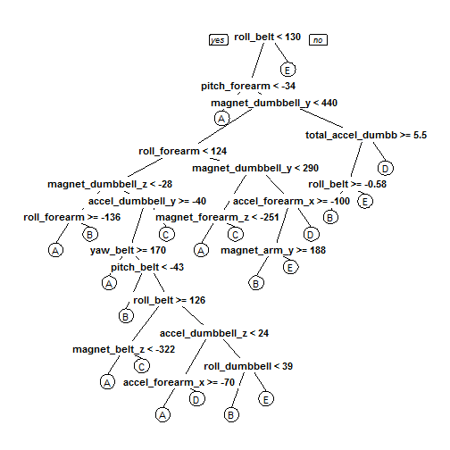

# Practical Machine Learning Course Project
#### By Sheila Yio
#### 17 March 2015

## Background

Using devices such as Jawbone Up, Nike FuelBand, and Fitbit it is now possible to collect a large amount of data about personal activity relatively inexpensively. One thing that people regularly do is quantify how much of a particular activity they do, but they rarely quantify how well they do it. In this project, we will use data from accelerometers on the belt, forearm, arm, and dumbell of 6 participants to predict the manner in which they did the exercise.  

The data and more information of the data is available from the website here: http://groupware.les.inf.puc-rio.br/har (see the section on the Weight Lifting Exercise Dataset).  
  
## Data Loading and PreProcessing

Firstly, we will load the training and testing data from the csv files into the data frames. Thereafter, we will remove the irrelevant columns/variables from the data frames.  


```r
## Assuming data files have been downloaded to the working directory
## Load data files
trainDataFile <- read.csv("pml-training.csv")
testDataFile <- read.csv("pml-testing.csv")

## To remove irrelevant variables
trainData <- trainDataFile[, colSums(is.na(trainDataFile))==0]
classe <- trainData$classe
trainToRemove <- grepl("^X|timestamp|window", names(trainData))
trainData <- trainData[, !trainToRemove]
trainData <- trainData[, sapply(trainData, is.numeric)]
trainData$classe <- classe

testData <- testDataFile[, colSums(is.na(testDataFile))==0]
testToRemove <- grepl("^X|timestamp|window", names(testData))
testData <- testData[, !testToRemove]
testData <- testData[, sapply(testData, is.numeric)]
testData <- testData[, -length(names(testData))]
```

## Data Partitioning to enable Predictive Modelling

To facilitate predictive modelling, we will further split the training dataset into training set (70%) and testing set (30%).  


```r
library(caret)

## Set seed for reproducibility
set.seed(12345)

## Split the trainData into training and testing sets
inTrain <- createDataPartition(trainData$classe, p=0.7, list=FALSE)
training <- trainData[inTrain, ]
testing <- trainData[-inTrain, ]
```

## Predictive Modelling

We randomly selected two predictive models for comparison: (1) classification tree, and (2) random forest algorithm.

### Predictive Model 1: Classification Tree


```r
## Train the model using classification tree algorithm
modelCT <- rpart(classe~., data=training, method="class")

## Plot classification tree
library(rpart.plot)
prp(modelCT)
```

 

```r
## Predict and check accuracy of model using testing set
predictCT <- predict(modelCT, newdata=testing, type="class")
confusionMatrix(predictCT,testing$classe)
```

```
## Confusion Matrix and Statistics
## 
##           Reference
## Prediction    A    B    C    D    E
##          A 1498  196   69  106   25
##          B   42  669   85   86   92
##          C   43  136  739  129  131
##          D   33   85   98  553   44
##          E   58   53   35   90  790
## 
## Overall Statistics
##                                           
##                Accuracy : 0.722           
##                  95% CI : (0.7104, 0.7334)
##     No Information Rate : 0.2845          
##     P-Value [Acc > NIR] : < 2.2e-16       
##                                           
##                   Kappa : 0.6467          
##  Mcnemar's Test P-Value : < 2.2e-16       
## 
## Statistics by Class:
## 
##                      Class: A Class: B Class: C Class: D Class: E
## Sensitivity            0.8949   0.5874   0.7203  0.57365   0.7301
## Specificity            0.9060   0.9357   0.9097  0.94717   0.9509
## Pos Pred Value         0.7909   0.6869   0.6273  0.68020   0.7700
## Neg Pred Value         0.9559   0.9043   0.9390  0.91897   0.9399
## Prevalence             0.2845   0.1935   0.1743  0.16381   0.1839
## Detection Rate         0.2545   0.1137   0.1256  0.09397   0.1342
## Detection Prevalence   0.3218   0.1655   0.2002  0.13815   0.1743
## Balanced Accuracy      0.9004   0.7615   0.8150  0.76041   0.8405
```

### Predictive Model 2: Random Forest


```r
## Train the model using random forest algorithm
modelRF <- randomForest(classe~., data=training)

## Predict and check accuracy of model using testing set
predictRF <- predict(modelRF, newdata=testing)
confusionMatrix(predictRF,testing$classe)
```

```
## Confusion Matrix and Statistics
## 
##           Reference
## Prediction    A    B    C    D    E
##          A 1673    9    0    0    0
##          B    1 1127   13    0    0
##          C    0    3 1011   14    0
##          D    0    0    2  949    5
##          E    0    0    0    1 1077
## 
## Overall Statistics
##                                          
##                Accuracy : 0.9918         
##                  95% CI : (0.9892, 0.994)
##     No Information Rate : 0.2845         
##     P-Value [Acc > NIR] : < 2.2e-16      
##                                          
##                   Kappa : 0.9897         
##  Mcnemar's Test P-Value : NA             
## 
## Statistics by Class:
## 
##                      Class: A Class: B Class: C Class: D Class: E
## Sensitivity            0.9994   0.9895   0.9854   0.9844   0.9954
## Specificity            0.9979   0.9971   0.9965   0.9986   0.9998
## Pos Pred Value         0.9946   0.9877   0.9835   0.9927   0.9991
## Neg Pred Value         0.9998   0.9975   0.9969   0.9970   0.9990
## Prevalence             0.2845   0.1935   0.1743   0.1638   0.1839
## Detection Rate         0.2843   0.1915   0.1718   0.1613   0.1830
## Detection Prevalence   0.2858   0.1939   0.1747   0.1624   0.1832
## Balanced Accuracy      0.9986   0.9933   0.9909   0.9915   0.9976
```

## Conclusion

The estimated accuracy of the classification tree model is 72.2%, while the estimated accuracy of the random forest model is 99.18%. As such, the random forest model is chosen as our predictive model, and the expected out-of-sample error of the chosen predictive model is 0.82%.
